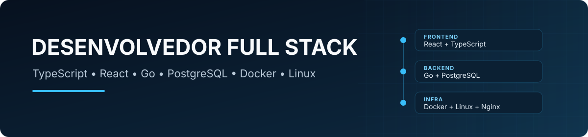

  

  
  &nbsp;&nbsp;&nbsp;
  

## Sobre

Desenvolvedor Full Stack com experiência no desenvolvimento de aplicações web, APIs e bancos de dados.

Trabalho com **React e TypeScript no frontend**, **Go no backend**, além de PostgreSQL, Docker e infraestrutura Linux.

## Stack

  
  &nbsp;
  
  &nbsp;
  
  &nbsp;
  
  &nbsp;
  
  &nbsp;
  
  &nbsp;
  
  &nbsp;
  
  &nbsp;
  

